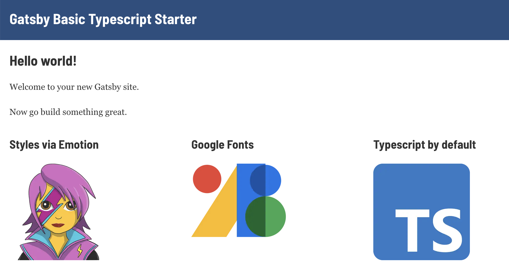

# gatsby-typescript-starter

[](https://github.com/noahub/gatsby-typescript-starter/blob/master/LICENSE)

This starter ships with the main Gatsby configuration files you need to build a basic site using React and Typescript



[View Demo Page](https://gatsby-basic-typescript-starter.netlify.app/)

This starter is an extension of the [Default Starter](https://github.com/gatsbyjs/gatsby-starter-default)

## Features

- Typescript installed and configured,
- Styled Components via Emotion,
- Google Fonts
- React Helmet for SEO,
- Configured image filesystem, transformer-sharp, plugin-sharp,

## Getting Started

1. Install this starter by running

   ```bash
   gatsby new typescript-starter https://github.com/noahub/gatsby-typescript-starter
   ```

2. Change directory

   ```bash
   cd typescript-starter
   ```

3. Run

   ```bash
   gatsby develop
   ```

   and visit your site at `http://localhost:8000`.

## Build

```bash
    gatsby build
```

## 💫 Deploy

[](https://app.netlify.com/start/deploy?repository=https://github.com/noahub/gatsby-typescript-starter)

[](https://zeit.co/import/project?template=https://github.com/noahub/gatsby-typescript-starter)

## Reporting issues

[gatsby-typescript-starter/issues](https://github.com/noahub/gatsby-typescript-starter/issues)
